# TECH1015-CW2
TECH1015 CW2 Submission - Ethan Taylor Starkey [P17206590]

# **Contents**:

* [1.1 // Title & Concept](#Concept)
* [2.1 // Starting off](#Starting-off)
  * [2.2 // Testing the first commit](#Testing-the-first-commit)
* [3.1 // Adding a tabbed content framework](#Adding-a-tabbed-content-framework)
  * [3.2 // First issues with the tab system ](#First-issues-with-tab-system)
  * [3.3 // Diving into the tab JavaScript](#Diving-into-the-tab-JavaScript)
* [4.1 // Enlarging content for viewing](#Enlarging-content-for-viewing)
  * [4.2 // Thumbnail rendering](#Thumbnail-rendering)
  * [4.3 // Reviewing how to showcase content](#Reviewing-how-to-showcase-content)
  * [4.4 // Further investigation on JS showcase](#Further-investigation-on-JS-showcase)
* [5.1 // Testing load speeds](#Testing-load-speeds)

# **Title**: Portfolio Webpage

## **Concept**:
### A portfolio website to showcase a range of my creative works, from fine art, to digital media that functions over a variety of devices (widescreen, mobile, tablet, standard PC, etc.).

---

*Utilising a tab system (using JavaScript to show and hide content divisions as needed) to catagorise different mediums of work from one-another, one tab focused on my fine art using various images to display examples of my previous artworks, another tab for my digital medium of work, another using video(s) (of suitable resolution for deployment) for my own video projects - Time (and suitable placement) permitting, I may be inclined to add a contact section for feedback or to get in contact with me.*

- Tabbed system to catagorise work mediums
- Be mindful the site still somewhat functions without becoming unusable if JavaScript is not enabled, as an example; this can be achieved (I believe) by structuring the site to work as a standard scrolling site, and then using divs+JS to hide/display the correct content as needed, this content could possibly begin to add onto the load times of the site also, which I will keep an eye on in testing as Firefox has a great tool for measuring load speed over average mobile data plan speeds AND tools for testing mobile features/adaption.

---

# **Starting-off**:

I will be beginning with what I believe to be the "standard" html set-up, an index.html page to act as a landing page for anyone visiting the site, for this case I will just be using this one page for my site and use JavaScript to give the illusion of different webpages, this should (hopefully) remove loading inbetween browsing on the site, with the majority of content being downloaded in advance (permitting that it is not a rediculous amount of data, so automatic videos or animated backgrounds are probably worth avoiding if not scaled accordingly).

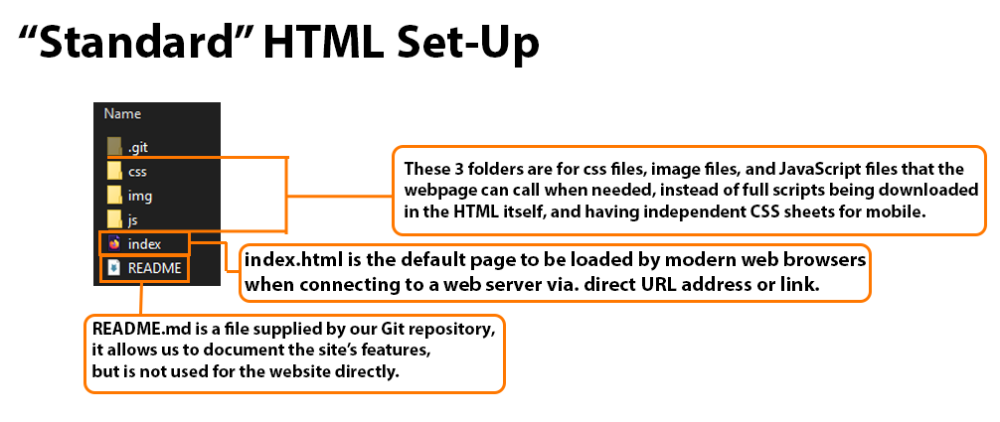


I want this site to be reflective of myself, the work I produce, and ideally a general aesthetic that isn't oversaturated with animated images or backgrounds that take away from the contents of the portfolio, but instead can compliment and highlight the portfolio's content.

I have previously experimented with works that utilised a gif background for mobile viewports, but a full-scale 1080p video for PC browsers, though this seems excessive as previously expressed. Perhaps though, the gif background, or more specifically a similar effect of light animation in the way of emulating the effect of a CRT monitor could be worth investigating.


## **Testing-the-first-commit**:

Interestingly enough, while trying to get my first commit of the site up to have a skeleton to work with and build on, when I first loaded the GitHub page, nothing showed but a black screen.

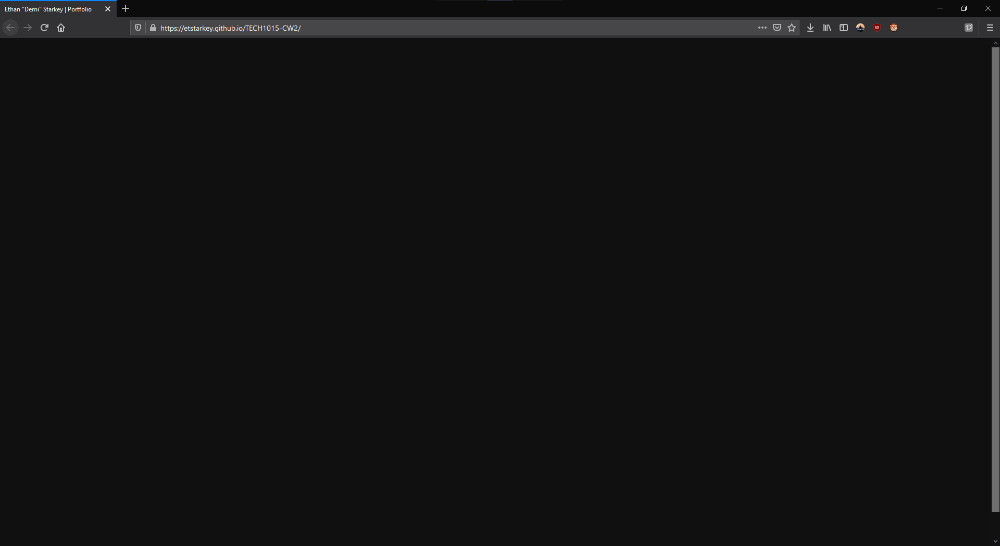

This struck me as odd, so I used Firefox's troubleshooting skill to locate a silly but common error:

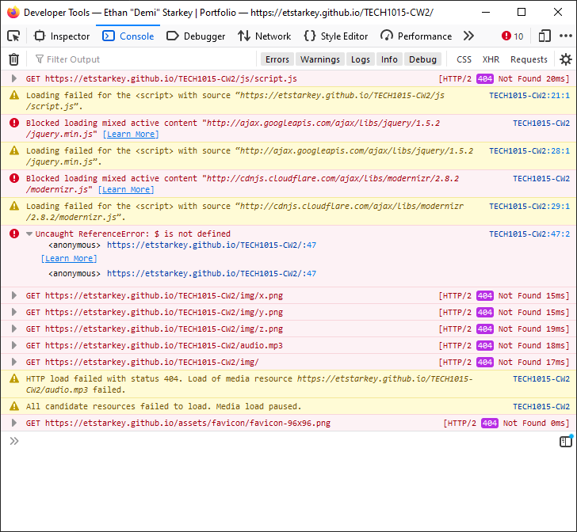

It turns out that two scripts were being blocked by Firefox because the portfolio site would load HTTPS, while these script links were HTTP - not HTTPS.
`"Starting in Firefox 23, mixed active content is blocked by default."`; this prevented the "Loader" script that would hide our .se-pre-con class cover for the site was not working as intended, and wouldn't reveal the site.

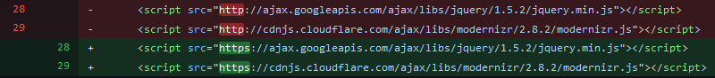

[After this small commit](https://github.com/ETStarkey/TECH1015-CW2/commit/f1cd13e86ad174b7d0e48af91d3695cf37418f2b) (GitHub Commit), the problem has been resolved, and the script works as intended, revealing the site after a fast load.

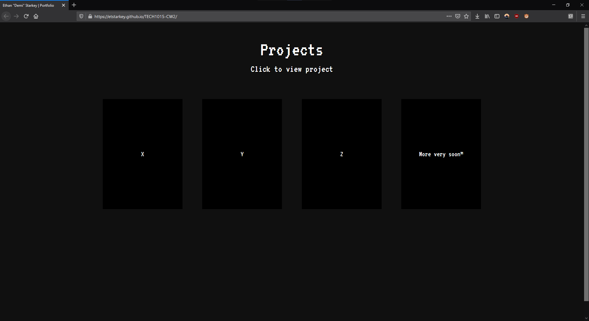

---

# **Adding-a-tabbed-content-framework**

Here, I will be experimenting with condensing all of the content the site needs to provide onto one webpage, but sorted using a tab system (alongside standard links too).

I believe the best way to approach this is by using multiple divs for the site content, and a seperate, always-visible div that can essentially anchor the navigation bar at the top of the page indefinitly, and then the seperate divisions of content can be controlled using either onClick links on the site (Such as in the fluid-grid on the home page), or the onClick links in the navigation bar at the top of the page; the onClick link will trigger with the line `onClick="openTab(event, 'home')"`.

This JavaScript will be a major component of the site in controlling the content and the site, to ensure the site doesn't encounter problems, we'd have to be sure that the site is deployed with a HTTPS certificate, [to avoid similar issues to before (First commit issues)](#Testing-the-first-commit).

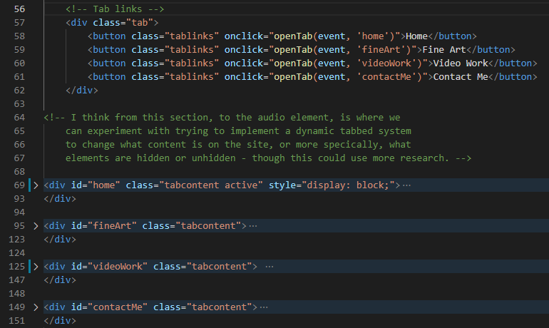

***Above***: *An overview of the changes to the HTML document - You can see a lengthy comment showing where I was planning on having the multiple sections for each section of content. You can see each div is labelled for what it's usage will be, such as `home` for the landing page for the site, and `videoWork` showcasing just video content from my portfolio, `fineArt` for my art.*

The content of each tab *is* similar, and this site could arguably be streamlined further, utilising JavaScript to dynamically update the site with data for content as it is needed, instead of having a bulk of HTML with all the content loaded at once visiting the site; this method can also help in ensuring that the right size video/imagery is used for the right viewport (i.e. smalled for mobile devices, or tablets, or even bigger for TVs).

This is, of course, something worth researching more into, and looking to implement into my work, however I am already aware that it is not an easy task and to cover all bases sufficiently would take a lot of time, not only to restructure the whole site's HTML and CSS, but also in having the various media content available in every resolution and format for all bases I'd want to cover.
For the case of restructing the site completely alone, I'm not sure this goal will be fully achievable, though I will ensure that this doesn't negatively impace the site by testing the load speeds of the site with everything together, and evaluate from there the state of the site and how to address any issues, should any come up. 

## **First-issues-with-tab-system**:

When I first implemented the tabbed system, I faced one issue that didn't render the site unusable, but severely negatively impacted the entire user experience of the site, where on the site loading, the page is blank with the exception of the navigation bar, clicking any link on the bar would fix this and show content as intended, but it made the home tab almost obselete and as stated, lowered the overall flow and experience of the site.

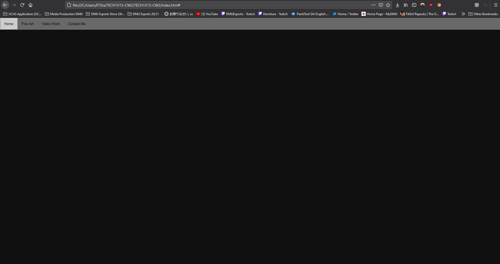

***Above***: *The empty canvas of the webpage on load, due to all content containers being hidden by the `tabcontent` class by default on page load, with nothing to indicate a default active page on landing.*


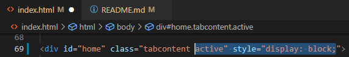

***Above***: *Adding a style tag to the div `home`, so that it shows the home tab when the page loads, I've done it this way for continuity with the JavaScript used for the tab system, as this is the same way the script controls content visibility.*

```js
function openTab(evt, tabName) {
		  var i, tabcontent, tablinks;
		  tabcontent = document.getElementsByClassName("tabcontent");
		  for (i = 0; i < tabcontent.length; i++) {
			tabcontent[i].style.display = "none";
		  }
		  tablinks = document.getElementsByClassName("tablinks");
		  for (i = 0; i < tablinks.length; i++) {
			tablinks[i].className = tablinks[i].className.replace(" active", "");
		  }
		  document.getElementById(tabName).style.display = "block";
		  evt.currentTarget.className += " active";
		}
```
***Above***: *The script for the tab system that shows content in the same way we manually did so for the homepage to show on loading the site. It can look overwhelming at first, but breaking it down can make it much easier to understand.*

## **Diving-into-the-tab-JavaScript**:
---


```js
function openTab(evt, tabName) {
          var i, tabcontent, tablinks;
```
This here is simply defining the function, and what parameters are to be brought into this function as a variable, and defining the variables of the script.

```js
          tabcontent = document.getElementsByClassName("tabcontent");
		  for (i = 0; i < tabcontent.length; i++) {
			tabcontent[i].style.display = "none";
		  }
```
This section here is gathering all elements with the class: `tabcontent` and hiding them.

```js
		  tablinks = document.getElementsByClassName("tablinks");
		  for (i = 0; i < tablinks.length; i++) {
			tablinks[i].className = tablinks[i].className.replace(" active", "");
		  }
```
The second section gathers all elements with the class: `tablinks` and removes the class: `active`, this is for the buttons on the navbar.

```js
		  document.getElementById(tabName).style.display = "block";
		  evt.currentTarget.className += " active";
```
The final section is what shows the content sections, by using the parameter called with the function: `tabName`, which is unique to each button on the navbar to hide all other elements that are tagged as `tabcontent` *with the exception* of the `tabcontent` associated to the `tabName` button that called the function, which has the display style applied to it to reveal it, and the active tag on the button to apply the `active` CSS to show the user which page they are on through the navbar.

# **Enlarging-content-for-viewing**:

As the site is a portfolio site, naturally it would be a useful feature for users to be able to select out a piece of content to look closer at, perhaps even get the full-scale image to download (we can use a direct link to the image/video to do this).

I believe this should be achievable by using a JavaScript function to essentially pull whatever content is selected to be in an element on a higher `z-index`, that is then unhidden to span the screen, and dim out the rest of the site using a high opacity background on this element. We would need to make sure there is an intuitive method of coming out of this view, probably clicking anywhere on the dimmed background outside of the media element being showcased (to allow video controls).

## **Thumbnail-rendering**:

To begin with, I need to render a couple of assests to be used for the thumbnails that will applied as the background the fluid-grid containers. For the videos page, a .gif rendered from the videos (or thumbnail) to the absolute size of the `.item` class should work well at a low resolution. For images, I think it'd be easier to simply run these images through photoshop on a template that is the size of the `.item` class again - This should lower the size of the files being loaded and displayed when the site loads initially.

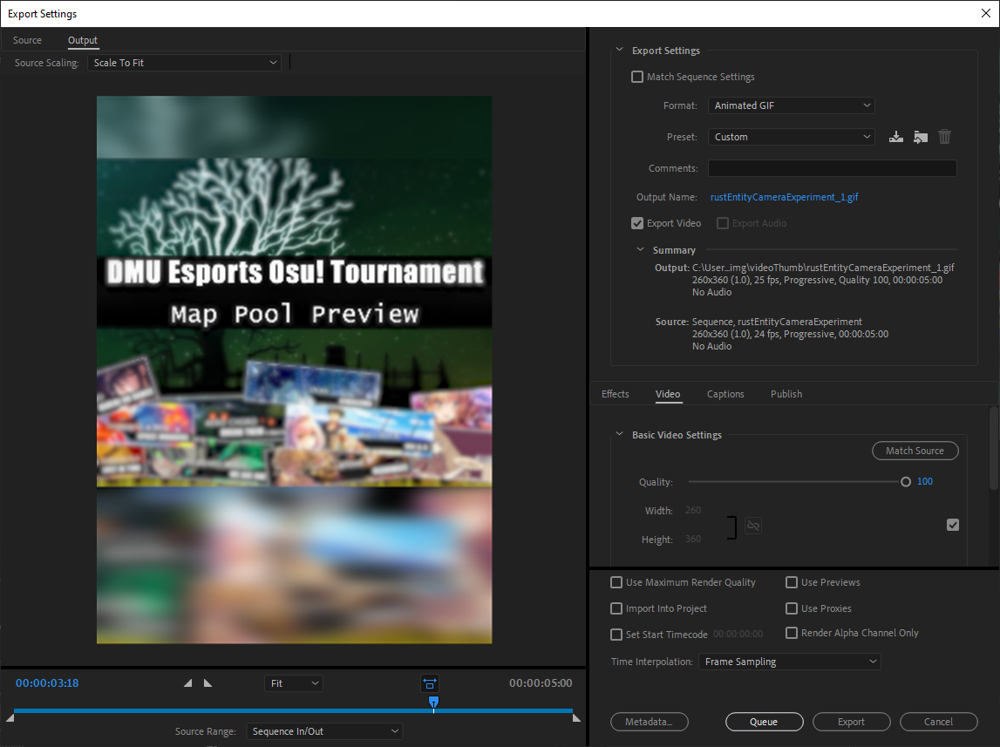

**Above**: *The rendering settings for all the gifs I produced for video thumbnails.*

**Below**: *The export settings for all the image thumbnails, I scaled this up as it looked a lot worse than the gifs at a lower resolution, so I doubled the resolution up to 520x720px.*


## **Reviewing-how-to-showcase-content**:

Upon a little bit of experimenting, I've come to see that it would be quite difficult to try and add this functionality, though it is possible with JavaScript, possibly in a similar way to the tab system, I think that having everything attached to being hidden, and made visible by a script is bloated enough in my opinion. It is also hard to efficiently do this in a script, at least with the framework I've given myself - I had hoped that there would be a way to do this via. CSS animations/transitions, but the closest to what we want is a `:hover` class (which we already have) or an `:active` class, but that is more effective with a checkbox (As I found here: https://stackoverflow.com/questions/39858998/zoom-in-and-out-on-mouse-click-with-css)

My initial idea was to use:
```css
.showcase:active {
		z-index: 100;
		height: 50%;
		width: 25%;
		background-color: rgba(0, 0, 0, 0.5);
	}
```
Applied either directly to the thumbnail element like so:
```html
<a href=#>
		<div class="item grow showcase" style="background-image:url(img/imgThumb/thumb-WindowScreenprint.png)">
			<p class="item-text">Window Screenprint</p>
		</div>
	</a>
```
Or applied to a checkbox to have a constant `:active` state, but the checkbox stays small and difficult for users to interact with.

Even after this, this will only enlarge the thumbnail assest element, not the full piece that the user wants to see - I think there are methods overcome this issue, again either with more JavaScript, but I think the idea of `@media` in CSS and dynamic adjustment could solve this, but I am not extremely well versed in this so it would be out of my expertise to pursue this idea.

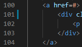

**Above**: *A link placeholder that's been directing to nowhere on each thumbnail element - This can be used to easily add navigation to content individually.*

Fortunately, this issues doesn't need to hold me up for too long, as I had prepared in advance for these features to possibly not come to fruition. Using the `<a href=#>` tags left around each thumbnail, we just need to decide if direct linking to content would be preferable to possibly making multiple 'husk' pages that feature the navigation bar to redirect back around the site, but are almost identical minus the content difference.

I'm hoping that sharing the same `main.css` and cached assests (fonts, for example) for any page could negate any reloading/refreshing of a downloaded assest, and minimise load times between pages.

## **Further-investigation-on-JS-showcase**:

HTML video player section, hidden by default:
```html
<div id="videoPlayerDiv">
    <video id="videoPlayer" width="560" height="315" src="#" style="display: none"/>
    <iframe id="ytPlayer" width="560" height="315" src="https://www.youtube.com/embed/qxGXvR9wWVM" title="YouTube video player" frameborder="0" allowfullscreen></iframe>
</div>
```
and using:
```html
<a onClick="videoSelection('vid-hobbyGameEdit')" href=#>
```
for videos stored on the webserver, and:
```html
<a onClick="videoSelection('yt_qxGXvR9wWVM')" href=#>
```
for the embed link, for a YouTube video (videos too large to be hosted on the GitHub webserver).

And for the JavaScript itself, we used:
```js
<script>
    function videoSelection(videoName) {
        var yt, ytLink, embedLink;
        yt = videoName.startsWith("yt_");

        if(yt = true){
            ytLink = videoName.substr(3);
            embedLink = "https://www.youtube.com/embed/";
            embedLink = embedLink.concat(ytLink);
            document.getElementById("ytPlayer").src = embedLink;
            document.getElementById("ytPlayer").style = "display: block";
            document.getElementById("videoPlayer").style = "display: none";
        } else {
            embedLink = videoName.concat(".mp4");
            document.getElementById("videoPlayer").src = embedLink;
            document.getElementById("videoPlayer").style = "display: block";
            document.getElementById("ytPlayer").style = "display: none";
        }
    }
</script>
```
I was hoping that I could utilise JavaScript and smart naming systems to change the sources of media elements on the site dynamically, but this attempt has been unsuccessful due to errors surrounding cookies and "SameSite" attributes.

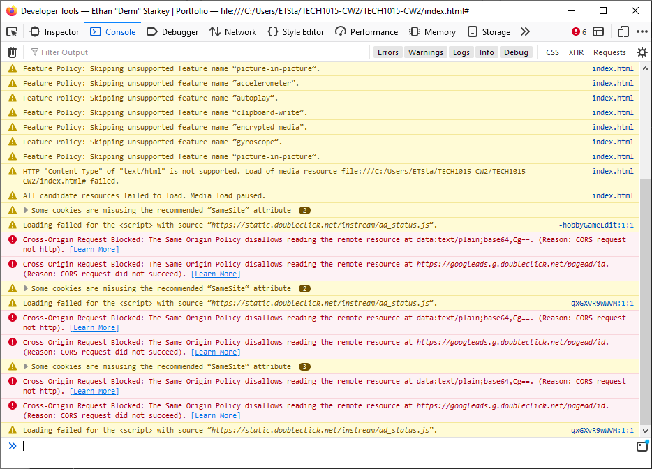

# **Testing-load-speeds**:

Just to ensure that my site is lightweight and loads fast, on mobile and PC, I will be checking the Firefox developer tools to measure if there is any clear delay in loading the site, but across the board, even limiting speeds to `Regular 3G speeds` sees little-to-no-decrease in the load speed even without cache.

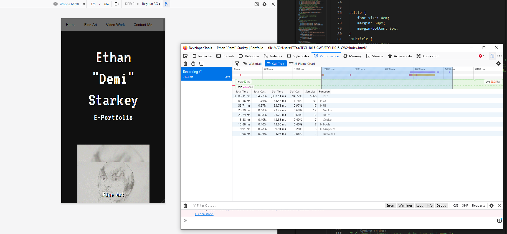
**Above**: *Firefox web developer tools, there are tons of tools here for a depth of web applications, but the one we're mainly focused on is the performance tab, that let's us know whenever the browser is having to work to load or calculate something.*


---